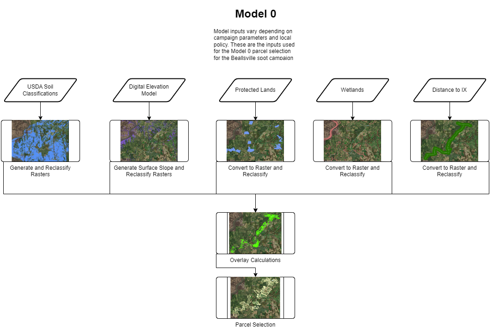
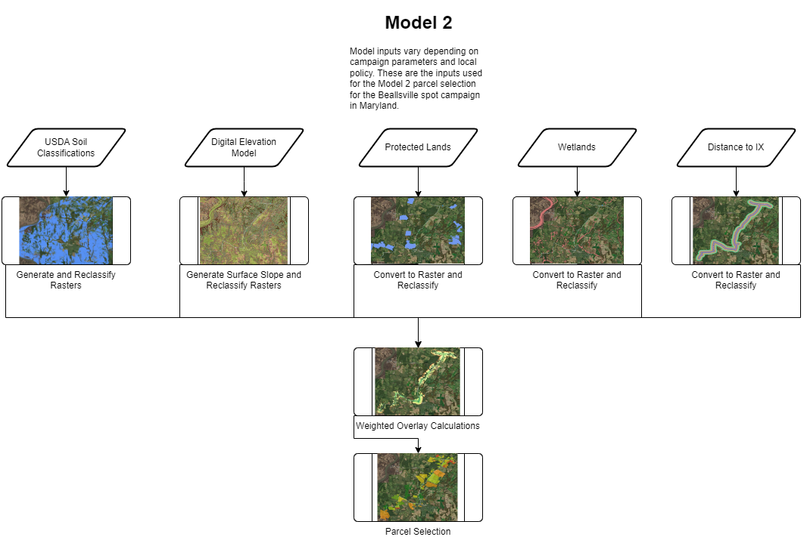
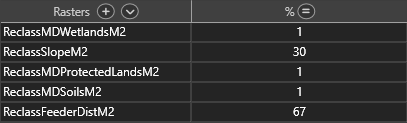

# Maryland Green Field Suitability Analysis and Siting
Herein we will document the modeling process for green field site selection and scoring using the Beallsville spot campaign as a case study.

<table>
<tr>
<th>Source Data Requirements</th>
<th>Datasets used in case study</th>
</tr>
<tr>
<td>

- Local or National wetlands dataset
  - NWI where local sources are not available.
- Digital Elevation Model
  - Most current is preferred at highest available resolution.
- Land Cover data
  - Available from USDA in a national dataset where local sources are not available.
- Parcel data
  - State datasets are usually available through state government. Occasionally local county municipality will have better data. Always perform check for data availability before continuing.
  - Prefer most recent dataset, regardless of data quality.
- Other datasets
  - Dependant on campaign needs and local solar policies. May include environmental justice areas, brownfield data, protected areas, etc.
</td>
<td>

- MD Wetlands, Maryland DNR.
  - Locally updated and surveyed version of NWI dataset provided by state department.
  - Used to determine areas of high soil water saturation and/or open water bodies.
- MD Protected Lands, Maryland Department of Planning.
  - Protected areas with easements that prevent or hinder projects.
  - Used to filter out areas with agricultural preservation easements.
- ned19_n39x25_w077x50_md_washingtondc_2008, USGS.
  - Most recent DEM from USGS for the study area.
  - Used to evaluate slopes, aspects, hydrology of the study area terrain.
- USDA Soil Classes
  - MDP provided soil class interpretations.
    - Class 1 and 2 soils were isolated as those soil classes are protected.
  - Used to determine areas that are not restricted from project development due to soil protection policies.
</td>
</tr>
</table>

---

## Model 0: 2022's Workflow
In 2022, our model used parameters to determine what areas are bad for development and what areas are not. This was then used to determine parcels with sufficient 'good' areas to develop a project.

This model was limited to parcel selection and provided no information on the quality of the parcel for projects beyond suitability.

Below is the general workflow for Model 0.

- Soil Classifications, Digital Elevation Model, Protected Lands, and Wetlands define restricted areas.
- Distance to IX defines a preference for sites closer to an IX feeder (roads in general campaigns).

Prior to post-processing, Model 0 returns 90 suitable parcels with no ranking or scoring for valuation of parcel quality.

---

## Model 1: 2023 Workflow with Unweighted Scoring

A scoring system was proposed for suitability analysis models in 2023. This is the first model that attempts to score parcels and value parcel quality. The purpose of scoring parcels is to give some guidance on option pricing for project parcels and reasoning for those pricings.

Below is the general workflow for Model 1. Note the changes in raster values by color.

- Soil Classifications, Protected Lands, and Wetlands remain as restricted areas.
- Digital Elevation Model now displays preferences for scoring and valuation based on civil scope valuations.
- Distance to IX now displays scored sections based on distance from the connection line.

These changes result in an overlay with multiple scored regions. These scored regions are then joined to the parcel data based on the largest area scored region within the parcel.

The resulting parcels are then scored from 1-9. This model resulted in 90 parcels scored between 7 and 9, giving 3 seperate score classes between the 90 parcels.

---

## Model 2: 2023 Workflow with Weighted Scoring

A modification to the scoring system where different weightings may be placed on different suitability parameters. This is the model that attempts to score parcels and value parcel quality. The purpose of weighing parcels is to generate more variance in parcel selection based on parameters we value higher than others.

Below is the general workflow for Model 2. Note the changes in raster values by color.

Models are weighted as the following:

Restricted areas recieve 1% to be included in the analysis, but given restricted areas are absolute, the weights greater than 1% are not necessary.

Slopes are currently set to 30% of the model weight, while distance to feeders is set to the remaining 67% of the model.

This model resulted in 90 parcels with scores between 3 and 9, giving 6 seperate score classes between the 90 parcels.

---

## Model 3: 2023 Workflow   &nbsp;&nbsp;&nbsp;&nbsp;&nbsp;&nbsp;&nbsp;&nbsp;&nbsp;&nbsp;&nbsp;&nbsp;&nbsp;&nbsp;&nbsp;&nbsp;&nbsp;with refined Weighting and added Parameters

TBD Following team meeting for refining and discussing potential additional parameters
